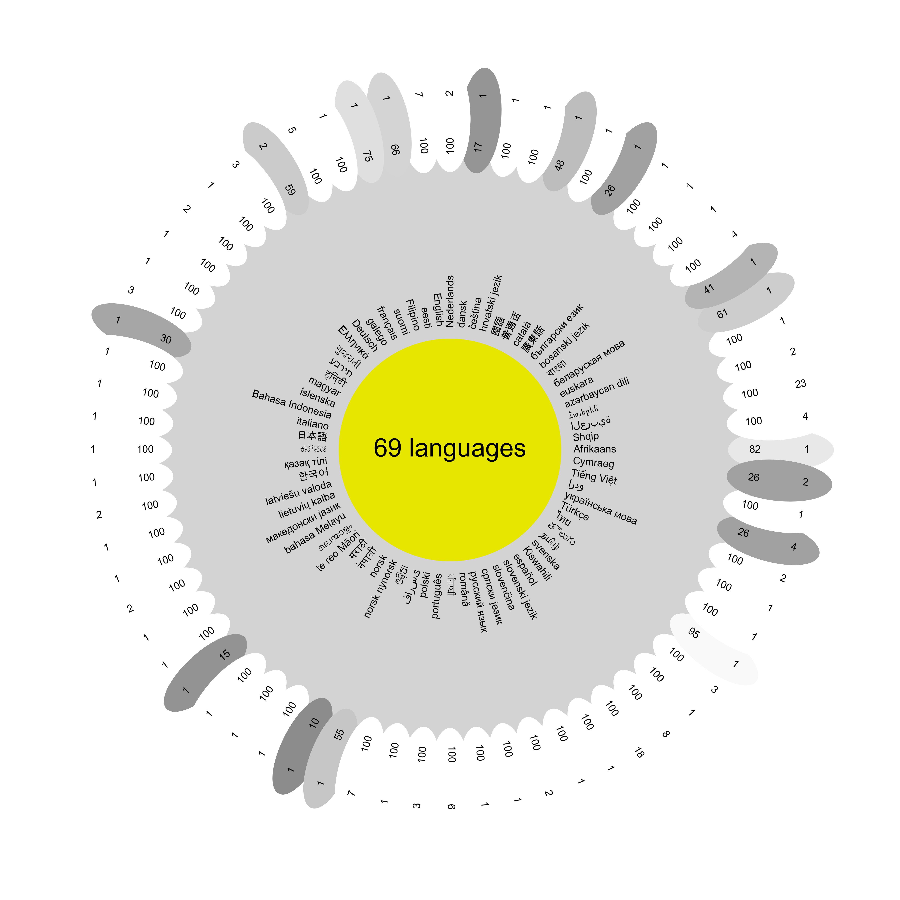

# daisy

[](https://github.com/ttsds/daisy/actions/workflows/test.yml)



Daisy is a diverse and multilingual speech dataset.
The principles behind Daisy differ from common speech datasets, as the goal is **evaluation of speech models**, rather than their training.
We only collect a small, but highly diverse set of samples for each language, complying with [fair use](#legal-disclaimer) by only using a small fraction of each data source. Instead of scraping first and filtering later, the starting point for each language is a set of "well-known sources", which are podcasts, content creators and broadcast networks associated with the language. This way, we can ensure that the dataset is diverse and representative of the language, while only including sources which are aware they are in the public eye -- additionally, we ask you to follow our [usage guidelines](#usage-guidelines) when using the dataset.


## Setup

1. Copy the example environment file:
   ```bash
   cp .example.env .env
   ```

2. Edit `.env` and set your environment variables:
   ```
   OPENROUTER_KEY=your_openrouter_api_key_here
   DAISY_ROOT=/path/to/your/daisy/data/directory
   ```

3. Install additional system dependencies:
   - `yt-dlp` for downloading audio from YouTube/Bilibili
   - `ffmpeg` for audio processing
   - `selenium` and Chrome/Chromium for web scraping

4. Install the package:
   ```bash
   pip install -e .
   ```

Please note that the package requires Python 3.10 or higher.

## Usage

This repository contains the code for collecting the dataset, as well as the code for creating the flower plot and other figures quantifying the dataset's diversity.

The following environment variables need to be set:
- `OPENROUTER_KEY`: The API key for OpenRouter.
- `DAISY_ROOT`: The root directory for the dataset.

The following scripts need to be run in order to collect the dataset:

### `scripts/01_collect_media_sources.py`
This script collects the media sources for each language.
It prompts and LLM (with online access) to list media sources for each language in the following three categories:
- Podcasts
- Broadcast news
- Content creators

It then saves the media sources to JSON files under the `{DAISY_ROOT}/{language}/{category}.json` directory.

### `scripts/02_collect_audio_items.py`
This script collects the audio items for each media source.
This is just the search for audio items (using YouTube and Bilibili) and not the actual downloading of the audio items.

It then saves the audio items to JSON files under the `{DAISY_ROOT}/{language}/{category}/{media_source_id}.json` directory.

### `scripts/03_filter_audio_items.py`
This script filters the audio items using another LLM.
It filters the audio items based on the following criteria:
- The audio item is from the creator of the media source.
- The audio item is in the right language.
- The audio item is mostly spoken content.

It then saves the audio items to JSON files under the `{DAISY_ROOT}/{language}/{category}-filtered/{media_source_id}.json` directory.

### `scripts/04_sample_audio_items.py`
This script samples the audio items from the filtered audio items, only including 100 audio items per media source, prioritising longer duration, more views and source diversity (as many different media sources as possible).
It then saves the audio items to a CSV file under the `{DAISY_ROOT}/{language}/sampled_items.csv` directory.

### `scripts/05_download_samples.py`
This script downloads the audio items from the sampled audio items.
It downloads the audio items from the YouTube and Bilibili URLs.
It then saves the audio items to the `{DAISY_ROOT}/{language}/samples` directory.

## Data Summary

A table summarising the dataset is available in the [data_summary.md](data_summary.md) file.

## API Reference

For detailed information about the Daisy package API, see [API.md](API.md).

## Legal Disclaimer

We only use a small fraction of each data source and only for non-commercial evaluation and research purposes, constituting fair use of the content. For a more detailed legal disclaimer, see [LEGAL.md](LEGAL.md).

## Usage Guidelines
When using this dataset, we ask you to follow two guidelines:
1. Do not use the dataset for training purposes, it is intended for evaluation of speech models only. This helps mitigate data leakage (although we also periodically refresh the dataset), while also avoiding speakers in the dataset being used for training generative models without their consent.
2. When cloning any of the voices in the dataset, only synthesise the transcripts which correspond to the speaker you are cloning. This ensures no utterances that conflict with the original speaker's intent are created.

## License

The source code for `daisy` is distributed under the terms of the [MIT](https://spdx.org/licenses/MIT.html) license.
